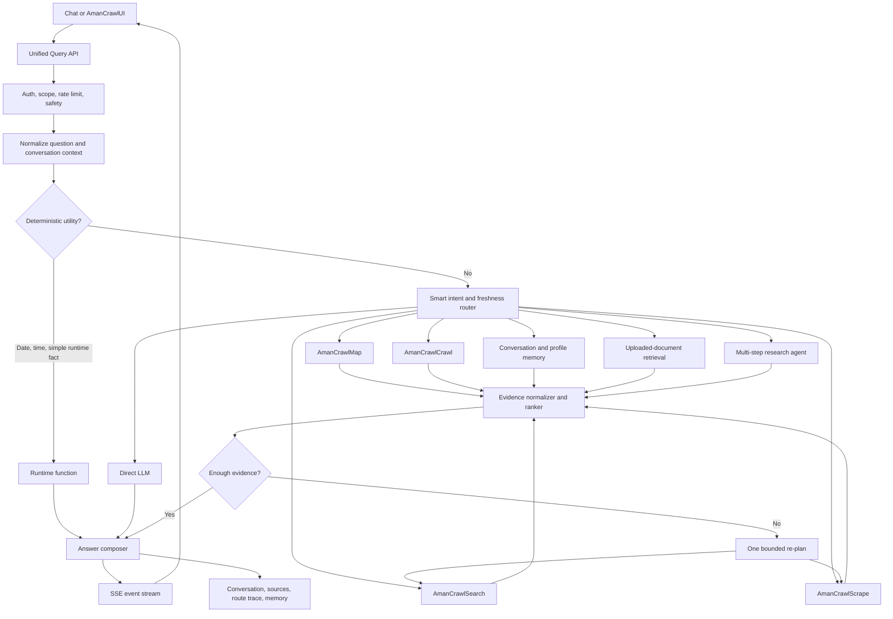

# Smart Search and AmanCrawlOrchestration Implementation Plan

## Purpose

This document is an implementation handoff for the new Context OS codebase. It defines how every chat question must be classified and routed so the system:

- answers current date/time through a deterministic runtime function;
- answers stable questions directly with the LLM when external data is unnecessary;
- searches the internet when freshness, verification, citations, or unknown information requires it;
- uses memory, uploaded documents, Search, Scrape, Map, Crawl, and Agent modes correctly;
- orchestrates multiple tools only when the question requires multiple steps;
- streams routing, progress, sources, and final answer data to the UI;
- degrades safely when a provider or crawler fails.

The goal is not to send every question to the internet. The goal is to make a deliberate, observable routing decision for every question.

## Existing Behavior to Preserve

The current repository already contains useful pieces that should be migrated rather than rewritten blindly:

- `backend/services/chat_routing.py` performs the initial `SOCIAL`, `UTILITY`, `DIRECT`, or `AGENT` classification.
- `backend/services/utility_answers.py` answers current date/time from the configured application timezone without an LLM or web call.
- `backend/app/routes/chat.py` streams chat events through SSE and persists conversations.
- `backend/agents/planner.py` and `backend/agents/router.py` plan and execute agent work with dependencies and parallel levels.
- `backend/services/search_router.py` implements provider fallback: Tavily, Brave, SearXNG, DuckDuckGo, then Google through Jina.
- `backend/app/routes/AmanCrawl.py` exposes AmanCrawlSearch, Scrape, Map, Crawl, Extract/Agent, and Intelligence behavior.
- `services/contextcrawl.ts` and `app/contextcrawl/page.tsx` fetch AmanCrawldata and render results/progress.
- `services/api.ts` and `components/chat/ChatInterface.tsx` consume chat SSE events and render tokens and sources.

## Current Problems

1. The first chat classification is mainly keyword and length based. A short factual question can be routed directly even when its answer is time-sensitive or unknown.
2. The `AGENT` path mixes memory, retrieval, web search, and research concerns. The system needs an explicit reason for each selected source.
3. Web search is currently close to an all-or-nothing setting for general chat. Availability is not the same as necessity.
4. Search results and page content are different evidence levels. A snippet may be enough for discovery, but important claims should be verified by scraping primary pages.
5. Search, Scrape, Map, Crawl, and Agent exist as separate AmanCrawlUI modes but are not expressed as one reusable tool-selection policy for chat.
6. The UI receives statuses and sources, but it does not receive one normalized route/plan object that explains what the backend decided.

## Required Architecture



## Core Design Rule: Create a Route Decision Before Calling Tools

Every non-social request must produce a typed `RouteDecision`. Do not scatter routing rules across route handlers and agents.

```json
{
  "mode": "direct | utility | memory | document | search | scrape | map | crawl | agent",
  "needs_fresh_data": false,
  "needs_web": false,
  "needs_citations": false,
  "target_urls": [],
  "search_queries": [],
  "reason": "stable explanatory question; model knowledge is sufficient",
  "confidence": 0.91,
  "max_tool_calls": 0,
  "fallback_mode": "search"
}
```

The decision must be logged and sent to the UI. A deterministic rule may produce it for clear cases. An LLM classifier may produce it for ambiguous cases, but its output must be schema-validated and constrained to allowed modes.

## Routing Policy

Apply the following stages in order. The first high-confidence match wins, except that document/memory evidence may be combined with web evidence when freshness is required.

### Stage 1: Deterministic, Zero-Tool Routes

Use local functions for:

- current date, time, day, and configured timezone;
- supported runtime health/configuration facts;
- greetings, thanks, and farewells;
- simple arithmetic if a trusted calculator function exists.

Current date/time must never be answered from model memory and must not trigger internet search.

### Stage 2: Explicit User Instructions

Honor explicit instructions before inference:

- “search”, “look up”, “browse”, “latest”, or “find sources” -> Search or Agent;
- “open/read/scrape this URL” -> Scrape;
- “list pages/URLs on this site” -> Map;
- “crawl this site/docs” -> Crawl;
- “extract these fields from this page/site” -> Scrape plus Extract/Agent;
- “use this PDF/file” -> Document retrieval;
- “remember/what did we discuss” -> Memory;
- “do not search the web” -> Direct, Memory, or Document only, with an uncertainty warning if fresh data is required.

### Stage 3: Freshness and Verification Detection

Set `needs_fresh_data=true` when the answer may have changed since model training. Signals include:

- current/latest/recent/today/this week/now;
- news, weather, scores, schedules, prices, exchange rates, availability;
- current people in roles, company leadership, product specifications, software versions;
- laws, policies, standards, security advisories, medical or financial guidance;
- recommendations that may cost meaningful time or money;
- a claim the user explicitly asks to verify or cite.

Do not depend only on keywords. The classifier must understand that “Who is the CEO of X?” is time-sensitive even without the word “current”.

### Stage 4: Known Source Selection

Use the narrowest sufficient mode:

| User need | Mode | Expected operation |
|---|---|---|
| Date/time | `utility` | Call runtime clock with configured timezone |
| Stable explanation or writing task | `direct` | LLM only |
| Prior user/conversation context | `memory` | Retrieve scoped memory, then answer |
| Question about uploaded content | `document` | Retrieve chunks and cite document pages/chunks |
| Discover relevant web pages or answer a fresh factual question | `search` | Multi-provider web search, rank results, answer with sources |
| Read one known URL | `scrape` | Fetch page using scrape fallback chain |
| Discover a site's URL structure | `map` | Sitemap/robots/HTML link discovery |
| Read multiple related pages | `crawl` | Bounded site crawl with allow/deny rules |
| Compare sources, investigate, extract, or complete several dependent steps | `agent` | Plan bounded Search/Scrape/Map/Crawl steps |

### Stage 5: Ambiguous Questions

For ambiguous questions, run a small structured classifier. If confidence is below `0.65`, choose the safest low-cost route:

- Direct for stable, creative, conversational, coding, or explanatory work.
- Search for factual questions with plausible freshness risk.
- Ask one clarification only when different interpretations would materially change the result or cost.

The router must not treat every long question as agent work or every short question as direct chat.

## AmanCrawlTool Semantics

### Search

Purpose: discover pages and obtain initial snippets.

- Keep the existing multi-provider fallback chain.
- Normalize every provider result to `title`, `url`, `snippet`, `provider`, `published_at`, and `score` where available.
- Deduplicate by canonical URL and near-duplicate title.
- Prefer authoritative and primary sources.
- Return provider attempts for observability, but do not expose secrets or raw provider errors to end users.
- Search snippets are discovery evidence. Scrape important pages before making high-stakes or detailed claims.

### Scrape

Purpose: retrieve content from one known URL.

- Preserve the existing fast-to-robust fallback chain (HTTP/Jina/browser/Crawl4AI as configured).
- Enforce SSRF protection: block loopback, private, link-local, and cloud metadata addresses after every redirect.
- Respect content-size, time, and redirect limits.
- Return normalized Markdown/text, metadata, links, final URL, provider, and extraction warnings.

### Map

Purpose: discover URLs without fully reading the whole site.

- Try `sitemap.xml` and robots-declared sitemaps first.
- Fall back to same-origin link discovery from seed pages.
- Canonicalize URLs, remove fragments, deduplicate, and apply include/exclude patterns.
- Never automatically crawl every mapped URL. Return the map to the planner, which chooses a bounded subset.

### Crawl

Purpose: read multiple pages on the same site.

- Require a page limit, depth limit, same-origin rule, timeout, and cancellation signal.
- Use a queue with URL deduplication and per-host concurrency limits.
- Stream page progress and recover partial results if some pages fail.
- Store crawl errors per URL instead of failing the entire job.

### Agent / Intelligence

Purpose: execute a multi-step research plan.

- Convert the user question into a small dependency graph.
- Execute independent searches/scrapes concurrently.
- Set hard budgets: default maximum 3 search queries, 5 scraped pages, one map, and 20 crawled pages unless the product plan allows more.
- Permit only one evidence-based re-plan.
- Stop early when evidence coverage is sufficient.
- Produce a final answer with citations mapped to the exact sources used.

## Orchestration Algorithm

```text
1. Authenticate, authorize scopes, rate-limit, and validate input.
2. Normalize question, URL(s), document ID, conversation ID, locale, and timezone.
3. Run deterministic utility classification.
4. Build RouteDecision using explicit instructions, source context, freshness risk,
   citation need, task complexity, and classifier confidence.
5. Emit route.decision.
6. Create a bounded ExecutionPlan.
7. Emit plan.created.
8. Execute plan steps with dependency-aware concurrency.
9. Normalize and rank all evidence.
10. Check evidence sufficiency, recency, authority, and contradiction.
11. If insufficient and budget remains, perform one re-plan; otherwise state the limitation.
12. Compose the answer using only supported evidence for fresh factual claims.
13. Emit answer tokens, source updates, completion metadata, and any partial failures.
14. Persist transcript, route decision, plan trace, sources, timings, and usage.
```

## Evidence Sufficiency Rules

The answer composer should receive evidence only after validation.

- Stable direct answer: no external evidence required.
- Ordinary fresh fact: at least one authoritative current source.
- Important or disputed claim: two independent sources where possible.
- High-stakes claim: primary/official source preferred and explicit uncertainty if not available.
- Document question: answer must be grounded in retrieved document chunks.
- URL question: answer must be grounded in scraped content, not only a search snippet.
- Conflicting sources: show the disagreement and dates instead of silently choosing one.

## Unified Backend API

Keep the specialized AmanCrawlendpoints, but add one reusable orchestration entry point for chat and future clients.

```http
POST /api/v1/query/stream
Content-Type: application/json
Accept: text/event-stream
```

```json
{
  "question": "Who is the CEO of Example Corp and what changed recently?",
  "conversation_id": "...",
  "doc_id": null,
  "mode": "auto",
  "timezone": "Asia/Kolkata",
  "options": {
    "web_allowed": true,
    "citations_required": true,
    "max_results": 5
  }
}
```

Allowed `mode` values should be `auto`, `direct`, `memory`, `document`, `search`, `scrape`, `map`, `crawl`, and `agent`. Manual mode is useful for AmanCrawltabs; `auto` is the normal chat mode.

## SSE Contract for UI Data Fetching

Use named SSE events with a stable envelope. Keep `token` compatibility during migration.

```json
{
  "event": "route.decision",
  "request_id": "req_...",
  "sequence": 2,
  "timestamp": "2026-07-16T10:30:00Z",
  "data": {}
}
```

Required events:

| Event | UI behavior |
|---|---|
| `request.accepted` | Create pending assistant message and cancel control |
| `route.decision` | Show mode chip such as Direct, Web Search, Crawl, or Memory |
| `plan.created` | Render planned steps in the progress panel |
| `step.started` | Mark a tool step active |
| `step.progress` | Update provider/page counts and progress text |
| `source.discovered` | Add a source card immediately |
| `step.completed` | Mark step complete and store timing |
| `step.failed` | Show non-fatal warning and fallback attempt |
| `answer.token` / `token` | Append streamed answer text |
| `answer.sources` | Replace provisional sources with the cited final set |
| `request.completed` / `done` | Finalize message, usage, route, timing, and persistence state |
| `request.failed` / `error` | Stop loading and show a retryable error |

Each source should use one schema across chat and AmanCrawl:

```json
{
  "id": "src_1",
  "title": "...",
  "url": "https://...",
  "domain": "example.com",
  "snippet": "...",
  "source_type": "search | scrape | crawl | document | memory",
  "provider": "tavily",
  "published_at": null,
  "retrieved_at": "2026-07-16T10:30:02Z",
  "citation_index": 1
}
```

## Frontend Requirements

### Chat UI

- Continue using `services/api.ts` as the single HTTP/SSE client boundary.
- Replace ad hoc event parsing with a discriminated `QueryStreamEvent` union.
- Maintain separate state for `route`, `planSteps`, `answer`, `provisionalSources`, `citedSources`, `warnings`, and `usage`.
- Display the routing decision without exposing chain-of-thought. Show only a short reason such as “Searching because this information may have changed.”
- Render sources as they arrive, then reconcile them with final citations.
- Support `AbortController` so Stop cancels the backend request and crawl job.
- Preserve partial answer and sources when a later tool fails.
- Never parse citations only from Markdown links; use structured source events as the source of truth.

### AmanCrawlUI

- Keep the Search, Scrape, Agent, Map, Crawl, and Intelligence tabs as manual modes.
- Send all modes through the same typed service layer in `services/contextcrawl.ts`.
- Reuse the same result/source types used by chat.
- Search input accepts a query; Scrape accepts one URL; Map/Crawl require a valid URL; Agent may accept either.
- Show provider fallback attempts, pages discovered, pages completed, per-page errors, elapsed time, and cancellation state.
- Do not make the UI infer success from HTTP 200 alone. Use explicit `status`, result counts, and errors.

## Suggested New-Code Module Boundaries

```text
backend/
  query/
    models.py              # RouteDecision, ExecutionPlan, evidence, SSE schemas
    router.py              # deterministic rules + structured ambiguity classifier
    freshness.py           # temporal-risk and citation rules
    orchestrator.py        # budgets, dependencies, concurrency, cancellation
    evidence.py            # normalization, dedupe, ranking, sufficiency
    answer.py              # grounded answer composition
    events.py              # ordered SSE event emitter
  tools/
    runtime.py             # date/time and safe local functions
    memory.py
    document.py
    search.py              # wraps existing multi-provider search router
    scrape.py
    map.py
    crawl.py
  app/routes/
    query.py               # unified streaming route

frontend/
  services/query.ts        # typed stream client
  lib/query-events.ts      # event and source types
  hooks/useQueryStream.ts  # stream lifecycle, reducer, abort/retry
  components/query/        # route chip, plan progress, source drawer
```

These are responsibility boundaries, not a requirement to create microservices. Keep one deployable backend until real scaling evidence requires separation.

## Failure and Fallback Policy

- Utility function fails -> return a clear runtime error; do not invent a date/time.
- One search provider fails -> try the next configured provider.
- All search providers fail -> answer from available context only and clearly say live search failed.
- Scrape blocked -> try the configured fallback chain; if still blocked, use search snippets only with a limitation warning.
- One crawl page fails -> continue and report the failed URL.
- LLM classifier fails -> apply deterministic conservative routing rules.
- LLM answer generation fails after sources are found -> retain the sources and offer retry without rerunning tools.
- Client disconnects -> cancel pending HTTP/browser/crawl tasks.
- Budget exhausted -> stop, answer from collected evidence, and state what remains unverified.

## Security and Operations

- Enforce auth and per-tool scopes before planning and again before execution.
- Apply SSRF checks to Scrape, Map, Crawl, and redirects.
- Treat web content as untrusted data. Tool instructions found inside pages must never override the system plan.
- Sanitize rendered Markdown/HTML and validate all outbound URLs.
- Redact API keys, authorization headers, cookies, and internal errors from events and logs.
- Record request ID, route, reason code, provider attempts, step latency, token usage, crawl pages, cache hits, and failure class.
- Add per-user and per-workspace cost budgets in addition to rate limits.
- Cache search results briefly and scraped pages according to freshness class; never use stale cache for a request explicitly asking for live/current data without labeling it.

## Architecture Decisions

### ADR-001: Use a hybrid deterministic and model-based router

**Status:** Proposed

**Decision:** Route clear utility, URL, document, memory, and explicit-tool requests with deterministic rules. Use a schema-constrained LLM classifier only for ambiguous semantic/freshness decisions.

**Alternatives considered:**

- Keywords only: fast and cheap, but misses implicit freshness such as current office holders.
- LLM for every request: flexible, but slower, more expensive, and less predictable for simple utilities.

**Consequences:** Better accuracy and predictable fast paths, with two routing mechanisms that require shared tests.

### ADR-002: Keep one orchestrator over specialized tools

**Status:** Proposed

**Decision:** Expose Search, Scrape, Map, Crawl, Memory, Document, and Runtime as tools behind one in-process orchestrator and unified event contract.

**Alternatives considered:** Separate service per tool now. This gives isolation but adds deployment, networking, tracing, and failure complexity before scale requires it.

**Consequences:** Easier migration and shared observability; long-running crawl work may later move to workers without changing the API contract.

### ADR-003: Use structured SSE as the UI contract

**Status:** Proposed

**Decision:** Stream normalized route, plan, progress, source, token, completion, and error events over SSE.

**Alternatives considered:** Polling adds latency and request overhead. WebSockets support bidirectional control but are unnecessary for the current request/stream interaction.

**Consequences:** Simple browser support and incremental UI; event ordering, reconnection, and compatibility must be tested.

## Implementation Phases

### Phase 1: Contracts and Router

1. Define `RouteDecision`, plan, evidence, source, and SSE event schemas.
2. Move utility/runtime checks behind the common decision interface.
3. Add explicit-instruction and freshness detection.
4. Add schema-constrained ambiguity classification.
5. Add routing unit tests before changing tool execution.

### Phase 2: Tool Adapters and Evidence

1. Wrap existing AmanCrawlSearch/Scrape/Map/Crawl implementations as typed tools.
2. Normalize results and errors.
3. Add URL canonicalization, deduplication, ranking, and sufficiency checks.
4. Add cancellation, timeouts, budgets, and SSRF protection.

### Phase 3: Orchestrator and Streaming API

1. Implement bounded plan execution and one re-plan.
2. Add the unified streaming route.
3. Emit ordered structured events while retaining old `token` and `done` compatibility.
4. Persist route/plan/source metadata with each assistant message.

### Phase 4: UI Integration

1. Add the typed query stream service and reducer hook.
2. Connect Chat to `mode=auto`.
3. Connect AmanCrawltabs to explicit modes.
4. Add route chip, progress display, source reconciliation, stop, retry, and partial-failure UI.

### Phase 5: Evaluation and Rollout

1. Run the routing evaluation set below.
2. Compare old and new routes behind a feature flag without executing both tool plans.
3. Inspect false-positive searches, missed fresh queries, latency, and provider failures.
4. Roll out gradually and retain a kill switch for automatic web execution.

## Minimum Routing Test Matrix

| Question | Expected mode |
|---|---|
| “What is the current date?” | Utility runtime function |
| “What time is it?” | Utility runtime function |
| “Explain dependency injection.” | Direct |
| “Write a polite follow-up email.” | Direct |
| “Who is the CEO of OpenAI?” | Search because role may change |
| “What happened in AI news today?” | Search/Agent |
| “What did I say about my launch plan?” | Memory |
| “Summarize the PDF I uploaded.” | Document |
| “Read https://example.com/pricing.” | Scrape |
| “List all documentation pages on this site.” | Map |
| “Read the first 20 pages of these docs and summarize them.” | Crawl/Agent |
| “Compare current pricing from these three vendors with citations.” | Agent using Search plus Scrape |
| “Do not browse; explain what a vector database is.” | Direct, web disabled |
| “Verify this medical claim.” | Search/Agent with primary-source preference and caution |

Also test typos, multilingual queries, relative dates, URLs without schemes, redirects to private IPs, provider timeouts, empty search results, partial crawl failure, user cancellation, and client disconnect.

## Acceptance Criteria

- 100% of current date/time tests use the configured runtime timezone and make zero LLM/web calls.
- Explicit Search/Scrape/Map/Crawl requests route correctly at least 99% of the time in the curated evaluation set.
- At least 95% of freshness-sensitive evaluation questions invoke web evidence.
- Stable direct questions do not invoke web tools at least 95% of the time.
- Every automatic tool call has a persisted reason code, request ID, latency, and outcome.
- Fresh factual answers expose structured sources; high-stakes answers prefer primary sources.
- Search provider failure automatically falls back without losing the request.
- Crawl cancellation stops pending work promptly and preserves completed pages.
- Chat and AmanCrawluse the same normalized source schema and progress event model.
- UI loading state always terminates on completed, failed, cancelled, or disconnected requests.
- No Scrape/Map/Crawl request can reach private or metadata-network addresses.

## Non-Goals for the First Version

- Do not split the tools into independent microservices yet.
- Do not crawl an entire site by default.
- Do not run a large autonomous agent loop.
- Do not save all raw web content permanently.
- Do not expose hidden model reasoning; expose short route reasons and observable tool steps only.

## Final Handoff Instruction

Implement this feature contract-first. Build and test `RouteDecision` before modifying chat execution, then wrap the existing AmanCrawlcapabilities as tools, add evidence validation, expose the unified SSE contract, and finally connect both UIs. Preserve the working runtime date/time function and the existing multi-provider/fallback logic while replacing implicit web behavior with explicit, testable orchestration.
