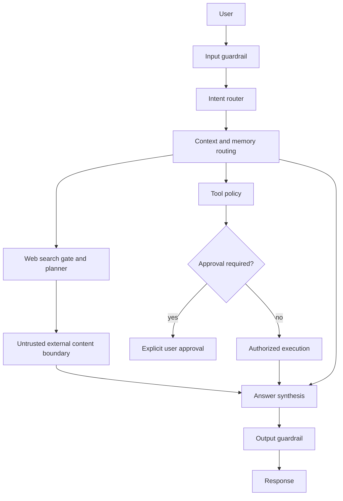

# Intent and source routing

Kontext routes chat requests through `backend/query/router.py` before retrieval or tool execution.

Flow:

1. Runtime utility and explicit mode checks.
2. Private user/conversation reference resolution.
3. Document, URL, action, current-information, and research routing.
4. Stable local answer fallback.
5. Chat pipeline retrieves selected memory/context and executes only the selected web path.

`RouteDecision` carries domain, intent, sub-intent, subject, operation, temporal requirement, source priority, confidence, and web policy.

Private questions such as `what is my name?`, `what i do?`, and `what are my skills?` route to profile or memory. Conversation recall routes to conversation context. Neither allows web search.

Stable questions route to model knowledge or existing conversation context. Current, recent, version, news, research, and explicit web requests route to search. Technology version and documentation requests use `documentation_search` mode.

Web content remains untrusted data. It is retrieved only after the route decision allows web access; it cannot update profile memory automatically or override system instructions.

## Defense in depth

`services/agent_guardrails.py` provides deterministic boundaries:

- input size and direct prompt-injection blocking;
- explicit untrusted-data wrappers for web content;
- secret redaction in model output;
- least-privilege tool metadata and scope checks;
- approval requirement for high-risk tools.

Custom and MCP adapters use `register_tool_handler` plus `execute_authorized_tool`; handlers cannot run before scope, parameter, and approval checks pass.

Chat routes pass authenticated account scopes into the runtime. Missing scopes block web, crawl, or agent execution before external calls. Existing durable coding approvals remain authoritative for coding actions.

Guardrail decisions should be logged with request ID, route, tool, scope, risk, and result. Never log raw prompts, secrets, tokens, or private document contents.
