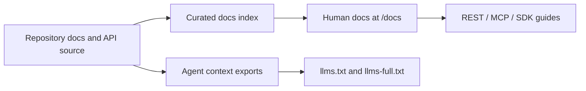

# TrueMemory Documentation Architecture

Status: accepted, incremental

## Decision

The first TrueMemory documentation platform is integrated into the existing Next.js application at `/docs`. Repository documentation remains the source of truth; the public page is a curated entry point over verified product and API behavior. Agent-oriented exports are published as `/llms.txt` and `/llms-full.txt`.

## Evidence policy

Documentation must distinguish verified current behavior, repository history, design intention, and future proposals. Historical claims are only published when supported by repository artifacts or git history. Unknown or unverified claims remain explicitly marked as unknown.

## Current scope

- Provider-first overview and start-here paths.
- Memory lifecycle, REST, MCP, authorization, and workspace isolation coverage.
- Human-readable public docs index with local search filtering.
- Plain-text agent context exports for indexing and retrieval.

## Deferred scope

Grounded documentation chat, Git/version switching, generated OpenAPI/SDK reference pages, and a full MDX content pipeline are follow-on work. They should consume repository-backed content and must not invent implementation details.
